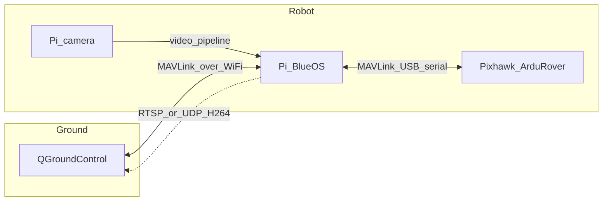

# Team22CombatRobot
Anything related to combat robot code
# Pi + Pixhawk (ArduRover) + BlueOS + QGroundControl

Living notes for this combat rover stack: **Pixhawk** runs **ArduPilot Rover**, **QGroundControl (QGC)** is the ground station, **BlueOS** on the **Raspberry Pi** bridges MAVLink (and optional video) over Wi‑Fi/Ethernet. Update the **Verified working** and **Versions** sections when you confirm each milestone—not every small tweak.

## Roles (what is not interchangeable)

| Piece | Role |
|--------|------|
| **QGroundControl** | Ground control station on your laptop/desktop: telemetry, parameters, joystick/gamepad → MAVLink. |
| **BlueOS** | Companion OS on the Pi: web UI, MAVLink routing, camera/video tooling. |
| **Pixhawk** | Autopilot: ArduRover firmware, motors/servos, failsafes. |
| **Pi** | Runs BlueOS; USB to Pixhawk; optional Pi camera. |

## Architecture

**Fallback:** Keep a way to connect QGC **directly** to the Pixhawk (USB to laptop or telemetry radio) for recovery if the Pi or network fails.

---

## Hardware (fill in as you lock it down)

| Item | Your notes |
|------|------------|
| Raspberry Pi model | e.g. 4B / 5 |
| Pixhawk / FC board | |
| Pi power | How the Pi is powered (buck from PDB, separate pack, etc.) |
| Pi ↔ Pixhawk link | **USB** (data-capable cable; avoid charge-only) |
| Pi camera | Module 2 / 3 / HQ / other |
| Network | Pi as AP vs Pi + laptop on same router |

---

## Versions (pin when something works)

| Component | Version |
|-----------|---------|
| BlueOS | e.g. [1.4.3](https://github.com/bluerobotics/BlueOS/releases) — update when you flash/upgrade |
| ArduPilot Rover (FC) | |
| QGroundControl | |
| Raspberry Pi OS base (if shown in BlueOS About) | |

---

## Reference links

- [BlueOS installation](https://blueos.cloud/docs/stable/usage/installation/)
- [BlueOS getting started](https://blueos.cloud/docs/stable/usage/getting-started/)
- [BlueOS advanced (updates, version chooser)](https://blueos.cloud/docs/stable/usage/advanced/)
- [BlueOS releases (images)](https://github.com/bluerobotics/BlueOS/releases)
- [ArduPilot Rover docs](https://ardupilot.org/rover/)

---

## Phase 1 — Flash BlueOS on the Pi

BlueOS is headless; you use the **web UI** after boot (see Getting Started). Official install summary:

1. **Pick the image** for your **exact** Pi from the [installation table](https://blueos.cloud/docs/stable/usage/installation/) and [GitHub Releases assets](https://github.com/bluerobotics/BlueOS/releases):
   - **Raspberry Pi 3B / 4B:** ARMv7 (32-bit) Bullseye — common default for Blue Robotics vehicles.
   - **Raspberry Pi 5:** ARMv8 (64-bit) Bookworm — noted as **limited testing** upstream; record issues in this README.
2. **Flash** a fresh SD card (≥ 4 GB; Class 10+ recommended) with [Balena Etcher](https://etcher.balena.io/) or similar.
3. **Boot** the Pi; first boot may take **~2 minutes** while the filesystem expands.
4. **Open the web UI** per [Getting Started](https://blueos.cloud/docs/stable/usage/getting-started/) — typically `http://blueos.local` on the same LAN, or the Pi’s IP.
5. **Update** BlueOS from the **Version Chooser** when the base system is up ([advanced docs](https://blueos.cloud/docs/stable/usage/advanced/)).

**Record here after first success:** image filename, SD size, Pi model, how you reach the UI (hostname/IP).

---

## Phase 2 — MAVLink over USB (Pi ↔ Pixhawk)

1. Power the Pixhawk appropriately (PDB/battery as you already verified ~23 V where expected).
2. Connect **Pixhawk USB → Raspberry Pi USB** with a **data** cable.
3. On the Pi (SSH or BlueOS terminal, if available), confirm the device appears, e.g. `ls /dev/ttyACM*` — often **`/dev/ttyACM0`** for a USB-connected flight controller.
4. In **BlueOS**, open the **MAVLink / autopilot / serial** configuration (exact menu labels vary by BlueOS version) and set the primary autopilot serial port to that device.
5. On the **flight controller**, ensure one **SERIALn** port is configured for MAVLink to the USB port you use (ArduPilot: `SERIALx_PROTOCOL` = MAVLink2, `SERIALx_BAUD` matches both ends — commonly **115200** or **921600**; **same baud** on FC and companion).
6. Confirm **heartbeat** / vehicle connection in the BlueOS UI.

**Record here:** `SERIAL` port index on FC, baud, BlueOS serial device path.

---

## Phase 3 — QGroundControl over the network

1. Put **laptop and Pi on the same IP network** (Wi‑Fi or Ethernet).
2. In **QGC**, add a **Comm Link**:
   - **UDP** to the **Pi’s IP address**, typically port **14550** (match whatever BlueOS exposes for MAVLink to GCS clients).
   - If BlueOS uses a different port or **TCP**, mirror that in QGC.
3. Connect the link; verify **telemetry**, **parameter download**, and **prearm** status.
4. Map your **joystick/gamepad** in QGC and test **disarmed** / safe setup first.

**Record here:** Pi IP (static or DHCP reservation), UDP/TCP port, QGC link name.

---

## Phase 4 — Pi camera → QGroundControl

1. In **BlueOS**, enable/configure the **camera / video** pipeline for the **Raspberry Pi camera** (driver details depend on module: v2 / 3 / HQ).
2. Expose a stream QGC can use — often **RTSP** or **UDP H.264** (depends on BlueOS version and QGC version).
3. In **QGC**, open **video settings** and set the stream URL or pipeline per QGC docs for your version.
4. Note **CPU load** and **latency**; reduce resolution/bitrate if the Pi struggles.

**Record here:** stream URL, resolution, codec, QGC video backend notes.

---

## Verified working

Check off as you prove each item on the bench or safe stand:

- [ ] BlueOS web UI reachable (`blueos.local` or IP)
- [ ] Pixhawk heartbeat visible through BlueOS (USB serial)
- [ ] QGC connects to Pi link; telemetry + parameters
- [ ] Joystick/gamepad commands reach rover (test safe/disarmed first)
- [ ] Pi camera stream visible in QGC (or in BlueOS preview + documented path to QGC)
- [ ] Fallback: QGC direct to Pixhawk still works when needed

---

## Troubleshooting

| Symptom | Things to check |
|---------|------------------|
| No `/dev/ttyACM*` | Cable (data vs charge-only), USB port, FC powered, `dmesg` on Pi |
| Heartbeat in BlueOS but not QGC | Firewall on Pi/laptop, wrong IP/port, QGC link type UDP vs TCP |
| Garbage / no MAVLink on serial | Baud mismatch FC ↔ BlueOS; wrong `SERIALx_PROTOCOL` on FC |
| Video stutters | Lower resolution/FPS; wired Ethernet instead of Wi‑Fi |

---

## Safety note

Treat **wireless loss**, **failsafes**, and a **physical disconnect** as part of the vehicle design. ArduRover FS parameters and hardware kill switches are outside this file but should match how you actually drive the robot.
