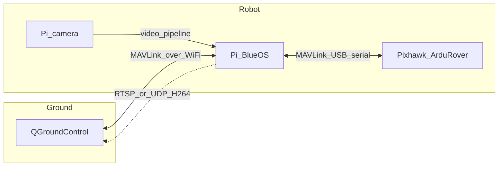

# Team22CombatRobot
Anything related to combat robot code
(AI assisted code writing)

# Pi + Pixhawk (ArduRover) + BlueOS + QGroundControl

Living notes for this combat rover stack: **Pixhawk** runs **ArduPilot Rover**, **QGroundControl (QGC)** is the ground station, **BlueOS** on the **Raspberry Pi** bridges MAVLink (and optional video) over Wi‑Fi/Ethernet. Update the **Verified working** and **Versions** sections when you confirm each milestone—not every small tweak.

## Roles (what is not interchangeable)

| Piece | Role |
|--------|------|
| **QGroundControl** | Ground control station on your laptop/desktop: telemetry, parameters, joystick/gamepad → MAVLink. |
| **BlueOS** | Companion OS on the Pi: web UI, MAVLink routing, camera/video tooling. |
| **Pixhawk** | Autopilot: ArduRover firmware, motors/servos, failsafes. |
| **Pi** | Runs BlueOS; USB to Pixhawk; optional Pi camera. |

## Architecture

**Fallback:** Keep a way to connect QGC **directly** to the Pixhawk (USB to laptop or telemetry radio) for recovery if the Pi or network fails.

---

## Hardware

| Item | Your notes |
|------|------------|
| Raspberry Pi model | **4B** (use **ARMv7 Bullseye Pi 4** BlueOS image) |
| Pixhawk / FC board | 6c|
| Pi power | separate pack 2s Battery|
| Pi ↔ Pixhawk link | **USB** (data-capable cable; avoid charge-only) |
| Pi camera | Module 2 / 3 / HQ / other |
| Network | Wi‑Fi: home SSID + lab SSID (see [WiFi home ↔ lab](#wifi-home--lab)); laptop + Pi on same LAN for QGC |

---

## Versions (pin when something works)

| Component | Version |
|-----------|---------|
| BlueOS | **[1.4.3](https://github.com/bluerobotics/BlueOS/releases/tag/1.4.3)** (update via Version Chooser after boot) |
| BlueOS SD image (Pi 4B) | **`BlueOS-raspberry-linux-arm-v7-bullseye-pi4.zip`** from [release assets](https://github.com/bluerobotics/BlueOS/releases/tag/1.4.3) |
| ArduPilot Rover (FC) | |
| QGroundControl | |
| Raspberry Pi OS base (if shown in BlueOS About) | Bullseye (32-bit ARMv7) under BlueOS |

---

## Reference links

- [BlueOS installation](https://blueos.cloud/docs/stable/usage/installation/)
- [BlueOS getting started](https://blueos.cloud/docs/stable/usage/getting-started/)
- [BlueOS advanced (updates, version chooser)](https://blueos.cloud/docs/stable/usage/advanced/)
- [BlueOS releases (images)](https://github.com/bluerobotics/BlueOS/releases)
- [ArduPilot Rover docs](https://ardupilot.org/rover/)

---

## Phase 1 — Flash BlueOS on the Pi 4B

BlueOS is **headless**; you configure it through the **web UI** after boot ([Getting Started](https://blueos.cloud/docs/stable/usage/getting-started/)).

### Image to download (Pi 4B)

For a **Raspberry Pi 4B**, use the **32-bit ARMv7 Bullseye** image named for Pi 4:

| Item | Value |
|------|--------|
| Release | [BlueOS 1.4.3](https://github.com/bluerobotics/BlueOS/releases/tag/1.4.3) (or newer **stable** from [releases](https://github.com/bluerobotics/BlueOS/releases)) |
| Asset file | **`BlueOS-raspberry-linux-arm-v7-bullseye-pi4.zip`** |

Do **not** use the Pi 5 / ARM64 Bookworm image on a 4B. If BlueOS adds a newer zip with the same naming pattern, prefer the **`…bullseye-pi4.zip`** asset for Pi 4B.

### Flash steps (walkthrough)

1. **SD card:** Use a **fresh** card, **≥ 16 GB** recommended (4 GB minimum per docs; more is easier for logs/updates). Quality Class 10 or better.
2. **Download** the zip from the release page above.
3. **Flash with [Balena Etcher](https://etcher.balena.io/)** (or Raspberry Pi Imager if you prefer—Etcher is what BlueOS docs recommend):
   - Etcher can flash from **`.zip`** directly; if you only see an **`.img`** inside the zip, extract once and select the **`.img`**.
   - Select the correct **drive** (your SD reader)—double-check so you do not wipe the wrong disk.
4. **Eject** the card cleanly, insert into the **Pi 4B**, connect **power** (and **Ethernet** if you want the simplest first connection—see below).
5. **First boot:** Wait **~2 minutes** (filesystem expand). Green activity on the Pi is normal.

### How to open the BlueOS web UI the first time

Per [BlueOS Getting Started — Interface Access](https://blueos.cloud/docs/stable/usage/getting-started/#interface-access):

| How Pi is connected | Try this in your browser |
|---------------------|---------------------------|
| **Ethernet** to your router/switch (same LAN as your laptop) | `http://blueos.local` or `http://blueos-ethernet.local` or `http://192.168.2.2` (static Ethernet IP documented by BlueOS) |
| **No Wi‑Fi configured** within **~5 minutes** of boot | Pi starts a **hotspot**: SSID **`BlueOS (******)`** (suffix varies), password **`blueosap`** → then `http://blueos-hotspot.local` |
| **USB-C from Pi 4 to computer** (data only; Pi still needs its own power) | `http://blueos.local` (see [USB OTG](https://blueos.cloud/docs/stable/usage/getting-started/#usb-otg); Pi draws a lot of power—do not rely on laptop USB for power) |

**Practical first-time tip:** If you can, use **Ethernet** for the first boot so your laptop and Pi share the same network without fighting Wi‑Fi. Then use the **Wi‑Fi icon** in the BlueOS header to join your **home** network ([WiFi home ↔ lab](#wifi-home--lab)).

6. On your **laptop** (on the same LAN, or connected to the Pi **hotspot**, or via **USB-OTG** as in the table), open the matching URL in a browser—**`http://blueos.local`**, or **`http://blueos-hotspot.local`** on the hotspot, or **`http://192.168.2.2`** on Ethernet—until the BlueOS dashboard loads.
7. Complete the **setup wizard** if shown (you can skip later once things work; internet on the Pi helps updates).
8. **Update** BlueOS from **Settings → BlueOS Version** ([Version Chooser](https://blueos.cloud/docs/stable/usage/advanced/#blueos-version)) once the Pi has internet.

**Record here after first success:** SD size, exact zip filename you flashed, and which URL worked (`blueos.local` / IP / hotspot).

---

## WiFi home ↔ lab

You will move between **home** and **lab** networks. The goal is: **your laptop and the Pi on the same IP network** so `blueos.local` (mDNS) or the Pi’s **IP** works, and QGroundControl can reach the Pi.

### Connect Wi‑Fi from BlueOS (any location)

From [Connect Wifi](https://blueos.cloud/docs/stable/usage/getting-started/#connect-wifi):

1. Open the BlueOS web UI (however you reached it: Ethernet, hotspot, or existing Wi‑Fi).
2. Click the **Wi‑Fi indicator** in the header → **scan** → select the **SSID** → enter password → **Connect**.
3. After it connects, the icon shows signal strength; the Pi should have a route to the internet if that network provides it (useful for updates).

### Switching from home to lab (and back)

- **Add both networks over time:** Each time you are on a new site, open the Wi‑Fi menu again and connect to that SSID. Linux **NetworkManager** (used under BlueOS) usually **keeps saved networks** and will connect to whichever is in range (priority may favor the last working one).
- **At the lab:** Power the Pi, wait for boot, connect your **laptop to the lab Wi‑Fi** (or Ethernet on the same subnet). If the Pi auto-joins the lab SSID you saved, open **`http://blueos.local`** or check your router’s DHCP client list for the Pi’s **IP** if mDNS is flaky.
- **If the Pi cannot join lab Wi‑Fi** (new SSID never saved): use **Ethernet** to a router/switch, or connect your laptop to the Pi’s **BlueOS hotspot** and add the lab network from the UI (laptop may need to reconnect to lab Wi‑Fi afterward for QGC on the same LAN as the Pi—see below).

### QGroundControl reminder when the IP changes

If you pointed QGC at a **specific Pi IP** from home, the Pi may get a **different IP** at the lab. Either:

- Use **`blueos.local`** in links where QGC allows a hostname, or  
- **Update the comm link** to the new IP from the lab router’s admin page or `arp`/`nmap` scan.

Fill these in when stable:

| Location | Wi‑Fi SSID (or “Ethernet”) | Pi IP or hostname used |
|----------|----------------------------|-------------------------|
| Home | | |
| Lab | | |

### Optional: make lab access predictable

- **DHCP reservation** on the lab router for the Pi’s MAC address → same IP every time at the lab.  
- **USB-C Ethernet gadget** from Pi to laptop for “always works” access without Wi‑Fi ([USB OTG](https://blueos.cloud/docs/stable/usage/getting-started/#usb-otg)); still put Pi + laptop on a shared network for QGC unless you bridge routes manually.

---

## Phase 2 — MAVLink over USB (Pi ↔ Pixhawk)

1. Power the Pixhawk appropriately (PDB/battery as you already verified ~23 V where expected).
2. Connect **Pixhawk USB → Raspberry Pi USB** with a **data** cable.
3. On the Pi (SSH or BlueOS terminal, if available), confirm the device appears, e.g. `ls /dev/ttyACM*` — often **`/dev/ttyACM0`** for a USB-connected flight controller.
4. In **BlueOS**, open the **MAVLink / autopilot / serial** configuration (exact menu labels vary by BlueOS version) and set the primary autopilot serial port to that device.
5. On the **flight controller**, ensure one **SERIALn** port is configured for MAVLink to the USB port you use (ArduPilot: `SERIALx_PROTOCOL` = MAVLink2, `SERIALx_BAUD` matches both ends — commonly **115200** or **921600**; **same baud** on FC and companion).
6. Confirm **heartbeat** / vehicle connection in the BlueOS UI.

**Record here:** `SERIAL` port index on FC, baud, BlueOS serial device path.

---

## Phase 3 — QGroundControl over the network

1. Put **laptop and Pi on the same IP network** (Wi‑Fi or Ethernet).
2. In **QGC**, add a **Comm Link**:
   - **UDP** to the **Pi’s IP address**, typically port **14550** (match whatever BlueOS exposes for MAVLink to GCS clients).
   - If BlueOS uses a different port or **TCP**, mirror that in QGC.
3. Connect the link; verify **telemetry**, **parameter download**, and **prearm** status.
4. Map your **joystick/gamepad** in QGC and test **disarmed** / safe setup first.

**Record here:** Pi IP (static or DHCP reservation), UDP/TCP port, QGC link name.

---

## Phase 4 — Pi camera → QGroundControl

1. In **BlueOS**, enable/configure the **camera / video** pipeline for the **Raspberry Pi camera** (driver details depend on module: v2 / 3 / HQ).
2. Expose a stream QGC can use — often **RTSP** or **UDP H.264** (depends on BlueOS version and QGC version).
3. In **QGC**, open **video settings** and set the stream URL or pipeline per QGC docs for your version.
4. Note **CPU load** and **latency**; reduce resolution/bitrate if the Pi struggles.

**Record here:** stream URL, resolution, codec, QGC video backend notes.

---

## Verified working

Check off as you prove each item on the bench or safe stand:

- [ ] BlueOS web UI reachable (`blueos.local` or IP)
- [ ] Pixhawk heartbeat visible through BlueOS (USB serial)
- [ ] QGC connects to Pi link; telemetry + parameters
- [ ] Joystick/gamepad commands reach rover (test safe/disarmed first)
- [ ] Pi camera stream visible in QGC (or in BlueOS preview + documented path to QGC)
- [ ] Fallback: QGC direct to Pixhawk still works when needed

---

## Troubleshooting

| Symptom | Things to check |
|---------|------------------|
| No `/dev/ttyACM*` | Cable (data vs charge-only), USB port, FC powered, `dmesg` on Pi |
| Heartbeat in BlueOS but not QGC | Firewall on Pi/laptop, wrong IP/port, QGC link type UDP vs TCP |
| Garbage / no MAVLink on serial | Baud mismatch FC ↔ BlueOS; wrong `SERIALx_PROTOCOL` on FC |
| Video stutters | Lower resolution/FPS; wired Ethernet instead of Wi‑Fi |

---

## Safety note

Treat **wireless loss**, **failsafes**, and a **physical disconnect** as part of the vehicle design. ArduRover FS parameters and hardware kill switches are outside this file but should match how you actually drive the robot.
